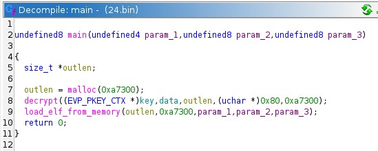
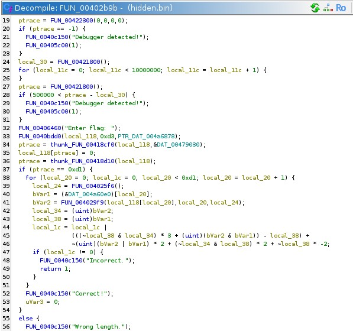
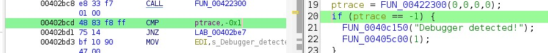
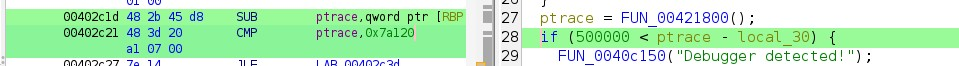
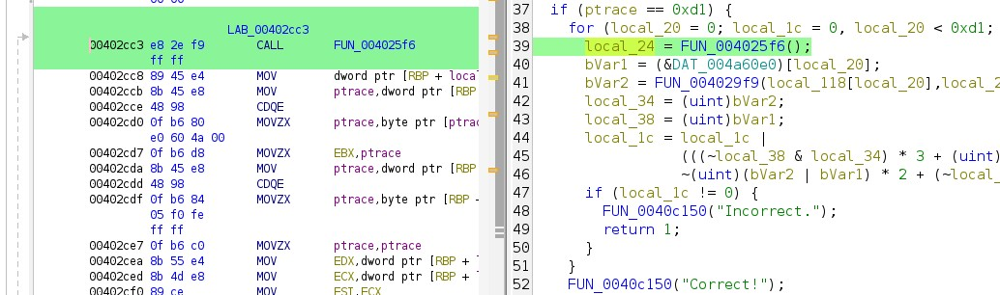
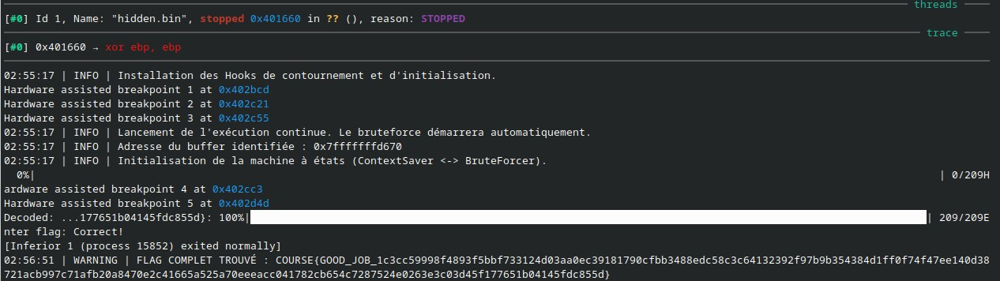
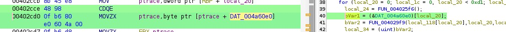

# Rapport - Reverse Engineering B2

**Auteur :** Corentinr
**Date :** 2026-02-04

Dans le cadre de l'exercice de rétro-ingénierie B2, j'ai mené une analyse du fichier `24.bin`. Ce rapport détaille les étapes d'investigation ayant permis d'extraire le flag.

## 1. Analyse préliminaire et extraction du binaire caché (Unpacking)

L'analyse initiale du fichier `24.bin` dans Ghidra révèle que ce binaire n'est pas le programme final, mais un **Loader** (ou *Packer*). Son rôle unique est de contenir une charge utile chiffrée (payload), de la déchiffrer en mémoire RAM, puis de l'exécuter sans jamais l'écrire sur le disque dur. Cette technique permet de complexifier l'analyse statique.

L'examen de la fonction `main` permet d'isoler rapidement cette logique en trois étapes : allocation, déchiffrement, exécution.

**Code extrait de Ghidra de la fonction main `24.bin` :**


**Code reconstitué de la fonction main `24.bin` :**

```c
int main(int argc, char **argv, char **envp) {
    void *decrypted_payload_buffer;
    size_t payload_size = 0xa7300;

    // 1. Allocation d'un espace mémoire pour recevoir le programme déchiffré
    decrypted_payload_buffer = malloc(payload_size);

    // 2. Routine de déchiffrement
    // La clé (key) et les données chiffrées (data) sont stockées dans la section .data
    decrypt(global_key, global_encrypted_data, decrypted_payload_buffer, 0x80, payload_size);

    // 3. Chargement et exécution du binaire depuis la mémoire
    load_elf_from_memory(decrypted_payload_buffer, payload_size, argc, argv, envp);

    return 0;
}

```

**Stratégie d'extraction de la payload `hidden.bin` : Approche Dynamique Automatisée**

Plutôt que d'analyser manuellement l'algorithme de déchiffrement, j'ai opté pour une approche dynamique : laisser le *loader* exécuter le déchiffrement et récupérer le binaire directement depuis la mémoire vive (RAM) juste avant son exécution.

Pour automatiser ce processus et le rendre reproductible, j'ai écrit à l'aide de Gemini 3 Pro un script Python et GDB nommé **`extract_hidden.py`**.

Ce script fonctionne selon la logique suivante :

1. **Interception (Hooking) :** Le script place un point d'arrêt automatique sur la fonction système `write`. En effet, pour exécuter le binaire déchiffré, le loader doit écrire son contenu dans un fichier mémoire (via `memfd_create`).
2. **Analyse à la volée :** À chaque appel de `write`, le script inspecte les premiers octets du buffer mémoire pour vérifier la présence de la signature magique **ELF** (`\x7fELF`).
3. **Extraction (Dumping) :** Dès que la signature est détectée, le script suspend l'exécution, copie le contenu complet du buffer vers le disque (fichier `hidden.bin`) et arrête le processus.


## 2. Analyse de la payload (`hidden.bin`)

Une fois le binaire `hidden.bin` extrait, je l'ai chargé dans Ghidra pour en comprendre la logique interne. L'analyse du point d'entrée (`processEntry`) redirige immédiatement vers la fonction principale `FUN_00402b9b`, qui contient l'intégralité de la logique de vérification et de protection.

Voici le pseudo-code brut fourni par Ghidra pour la fonction principale. On y distingue des appels de fonctions opaques et des structures de contrôle spécifiques.

**Code extrait de Ghidra de la fonction `FUN_00402b9b` :**


L'analyse de ce code permet d'identifier trois composants critiques que j'ai traduits dans le code nettoyé ci-dessous.

**Code reconstitué de la payload :**

```c
int main_payload() {
    // --- 1. Protections Anti-Debug ---
    
    // Tentative de s'attacher à soi-même. Échoue si GDB est présent.
    if (ptrace(PTRACE_TRACEME, 0, 0, 0) == -1) {
        print("Debugger detected!");
        exit(1);
    }

    // Vérification du temps d'exécution (Timing Check)
    long start_time = get_timestamp();
    for (int i = 0; i < 10000000; i++) { /* Boucle inutile */ }
    long end_time = get_timestamp();

    // Si la boucle a pris trop de temps (> 0.5s), on suppose un debug
    if ((end_time - start_time) > 500000) {
        print("Debugger detected!");
        exit(1);
    }

    // --- 2. Saisie Utilisateur ---
    print("Enter flag: ");
    char input[256];
    read_input(input);

    // --- 3. Vérification de la Longueur ---
    // 0xD1 = 209 décimal
    if (strlen(input) == 209) {
        
        // --- 4. Vérification du Contenu ---
        for (int i = 0; i < 209; i++) {
            // Lecture de la valeur attendue en mémoire (table chiffrée)
            byte expected = ENCRYPTED_TABLE[i]; 
            
            // Transformation du caractère
            byte calculated = transform_char(input[i], i);

            // Comparaison
            if (calculated != expected) {
                print("Incorrect.");
                return 1;
            }
        }
        print("Correct!");
        return 0;
    } else {
        print("Wrong length.");
        return 1;
    }
}

```

**A. Les protections Anti-Debug**
Le code effectue deux vérifications avant même de demander le flag :

1. **Ptrace (`FUN_00422300`)** : L'appel avec des arguments à `0` correspond à la signature de `ptrace(PTRACE_TRACEME, 0, 0, 0)`. Si le retour est `-1`, cela signifie qu'un processus parent (comme GDB) trace déjà le programme.
2. **Timing Attack (`FUN_00421800`)** : Le programme capture un temps de départ, effectue une boucle vide de 10 millions d'itérations, puis capture le temps de fin. Si la différence dépasse `500000` cycles (ou microsecondes), il en déduit qu'un humain ou un debugger ralentit l'exécution (par exemple via du "stepping").

**B. La contrainte de longueur**
La fonction `thunk_FUN_00418d10` (équivalent à `strlen`) vérifie la taille de l'entrée utilisateur stockée dans `local_118`.
La condition `if (lVar3 == 0xd1)` impose une longueur stricte de **209 caractères** (0xD1 en hexadécimal).

**C. La boucle de vérification**
Si la longueur est bonne, une boucle parcourt les 209 caractères.

* `bVar1 = (&DAT_004a60e0)[local_20]` : Le programme lit un octet attendu depuis un tableau en mémoire.
* `bVar2 = FUN_004029f9(...)` : Il transforme un caractère d'entrée via une fonction complexe.
* `if (local_1c != 0)` : Le bloc mathématique complexe qui précède sert en réalité à comparer `bVar1` et `bVar2`. Si le résultat n'est pas nul, le flag est incorrect.

### Conclusion de l'analyse

Cette analyse statique révèle deux informations cruciales pour la suite :

1. **Le format du flag :** Il doit faire exactement **209 caractères**.
2. **L'obstacle technique :** Des mécanismes de défense active complexifient l'analyse dynamique standard (notamment sous GDB), car les protections ptrace et timing provoquent l'arrêt immédiat du processus.

## 3. Analyse et Résolution Dynamique

Bien que l'algorithme de vérification semble complexe au premier abord, il possède une faiblesse structurelle majeure : il valide l'entrée caractère par caractère. Cela nous permet de transformer un problème impossible (trouver 209 caractères simultanément) en 209 problèmes simples (trouver 1 caractère)

Une attaque par canal auxiliaire ("Oracle") assistée par GDB est ainsi envisageable : on teste chaque caractère un par un, et on **rembobine l'exécution** du processeur en cas d'erreur pour rejouer la boucle avec une nouvelle tentative.

Cette méthode nécessite alors une exécution "furtive" pour ne pas déclencher les mécanismes d'autodéfense du binaire.

### 3.1. Cartographie des adresses et contournement des protections

Pour automatiser l'attaque, j'ai mappé les variables locales identifiées dans Ghidra avec les registres du processeur. Une attention particulière a été portée au type de breakpoints utilisés.

**A. La protection d'intégrité (Checksum)**
Lors de mes premiers essais, l'utilisation de breakpoints logiciels standards (qui insèrent l'instruction `0xCC` dans le code en mémoire) provoquait un arrêt immédiat du programme, même en contournant `ptrace`.
Cela indique la présence d'une **vérification d'intégrité** : le programme lit sa propre mémoire (section `.text`) pour vérifier qu'elle n'a pas été altérée.

* **Solution technique :** Utilisation exclusive de **Breakpoints Matériels** (`hbreak` dans GDB).
* **Fonctionnement :** Contrairement aux breakpoints logiciels, ils utilisent les registres de débogage du processeur (`DR0`-`DR3`) sans modifier un seul octet du code binaire en RAM. Le contrôle d'intégrité est ainsi contourné car le programme se voit "intact".

**B. Les protections Anti-Debug Actives**
Les 2 protections explicites qui ont été identifiées précédemment :

* **Adresses identifiées :** `0x402bcd` (Appel Ptrace) et `0x402c21` (Comparaison Temps).
* **Contre-mesure :** Les breakpoints matériels placés sur ces adresses exécutent une commande GDB silencieuse pour forcer le registre de retour `$rax` à `0`. Cela simule un succès de l'appel système et une exécution instantanée, leurrant le programme.






<div class="center">
    <em>Identification des appels anti-debug dans Ghidra</em>
</div>

**C. La boucle de vérification (L'Oracle)**
C'est le cœur de l'attaque. On isole la boucle `for` principale.



<div class="center">
    <em>Début de la boucle de vérification et variable d'accumulation d'erreur</em>
</div>

Dans le code décompilé, la variable `local_1c` agit comme un accumulateur d'erreur.

* Si le caractère est bon : `local_1c` reste à `0`.
* Si le caractère est mauvais : `local_1c` devient non-nul.

En analysant l'assembleur correspondant, on peut localiser:

1. **Le début du calcul (`ADDR_LOOP_START` - 0x402cc3) :** L'endroit exact où commence le traitement d'un caractère.
2. **La vérification (`ADDR_CHECK_JUMP` - 0x402d4d) :** L'instruction `CMP` qui vérifie la variable `local_1c`.
3. **La variable d'erreur :** Elle est située à l'adresse relative `rbp - 0x14`.

### 3.2. Algorithme de "Time Travel Debugging"

Avec l'aide de Gemini 3 Pro, j'ai développé le script `solve_dynamic.py` qui implémente une machine à états dans GDB exploitant les Hardware Breakpoints. Le principe est de transformer le programme en un oracle qui répond "Oui/Non" pour chaque lettre, sans jamais redémarrer le processus.

L'algorithme fonctionne ainsi :

1. **Snapshot (Sauvegarde) :**
    Au début de la boucle (`ADDR_LOOP_START`), un breakpoint matériel sauvegarde l'état de la pile (registres `$rsp` et `$rbp`). C'est un point de restauration.
2. **Exécution & Verdict :**
    On laisse le programme calculer. Arrivé à la vérification (`ADDR_CHECK_JUMP`), on lit la mémoire à `$rbp - 0x14`.
    * **Si 0 (Succès) :** Le caractère est validé. On passe au suivant.
    * **Si != 0 (Échec) :** Le caractère est invalide.
3. **Rembobinage (Rewind) :**
    En cas d'échec, le script effectue un "saut dans le temps" arrière :
    * **Incrémentation :** On teste le caractère ASCII suivant (ex: 'A' -> 'B').
    * **Injection Mémoire :** On écrit ce nouveau caractère directement dans le buffer input du programme (`rbp - 0x110`).
    * **Restauration de Contexte :** On rétablit `$rsp` et `$rbp` à leurs valeurs sauvegardées.
    * **Saut Temporel :** On force le pointeur d'instruction (`$rip`) à revenir à `ADDR_LOOP_START`.

```python
# Extrait de la logique de rembobinage (solve_dynamic.py)
# 1. Restauration du contexte (Stack Frame)
gdb.execute(f"set $rsp = {state.saved_context['rsp']}")
gdb.execute(f"set $rbp = {state.saved_context['rbp']}")
# 2. Nettoyage de l'accumulateur d'erreur
gdb.execute("set *(int*)($rbp-0x14) = 0")
# 3. Modification du pointeur d'instruction (Time Travel)
gdb.execute(f"set $rip = {ADDR_LOOP_START}")

```

Cette technique force le processeur à "oublier" qu'il a déjà exécuté le calcul erroné et à rejouer la séquence mathématique avec une nouvelle donnée. Cela permet de brute-forcer le flag caractère par caractère en temps réel, malgré les dépendances entre les caractères.

### 3.3. Résultat

L'exécution du script permet de recouvrer l'intégralité du flag en environ 1min30, contournant simultanément l'anti-debug, le contrôle d'intégrité et la complexité cryptographique.

```text
WARNING | FLAG COMPLET TROUVÉ : COURSE{GOOD_JOB_1c3cc59998f4893f5bbf733124d03aa0ec39181790cfbb3488edc58c3c64132392f97b9b354384d1ff0f74f47ee140d38721acb997c71afb20a8470e2c41665a525a70eeeacc041782cb654c7287524e0263e3c03d45f177651b04145fdc855d}
```


## 4. Analyse et Résolution Statique

Bien que la méthode dynamique soit fonctionnelle, elle reste une méthode "Boîte Noire" qui contourne le problème sans le résoudre mathématiquement. Une analyse plus fine du code assembleur permet de comprendre l'algorithme de chiffrement et de le casser instantanément sans même exécuter le programme, évitant ainsi totalement les protections anti-debug.

### 4.1. Extraction des données de référence (`DAT.bin`)

L'analyse de la boucle de vérification (identifiée en section 2) montre que chaque caractère transformé est comparé à un octet lu en mémoire.
Contrairement à une génération aléatoire, cette lecture se fait à une adresse **fixe et hardcodée** dans le binaire.



<div class="center">
    <em>Adresse du tableau chiffré (`0x4a60e0`)</em>
</div>

En examinant l'instruction assembleur correspondante, j'ai identifié l'adresse de base du tableau de comparaison : **`0x4a60e0`**. La boucle s'exécutant 209 fois, on doit ainsi extraire les 209 octets situés à cette adresse.

Avec l'aide de Gemini 3 Pro, j'ai automatisé cette tâche avec le script **`extract_DAT.py`**. Contrairement à l'extracteur précédent, celui-ci est **statique** : il utilise GDB pour ouvrir le fichier `hidden.bin` et copier la zone mémoire brute vers le disque, sans jamais lancer l'exécution (`run`), rendant les protections anti-debug inopérantes.

### 4.2. Inversion de l'Algorithme (Cryptanalyse)

L'obstacle principal de l'analyse statique est la fonction de transformation `FUN_004029f9`.

**Code Reconstitué de `FUN_004029f9` (Transform Char) :**

```c
// Fonction de transformation d'un caractère
// param_1 : Le caractère d'entrée (input[i])
// param_2 : L'index de la boucle (i)
// param_3 : La "Seed" d'intégrité (calculée par la fonction précédente)
byte transform_char(byte input_char, int index, uint integrity_seed) {
    // --- 1. Protections Anti-Debug (Timing Attacks) ---
    check_timing(); // 1ère vérification
    
    // --- 2. Étape 1 : XOR avec la Seed ---
    // On extrait un octet de la seed en fonction de l'index (les 3 derniers bits) Formule Ghidra : param_3 >> (bVar1 & 7) & 0xff
    byte key_seed = (integrity_seed >> (index & 7)) & 0xFF;
    
    // On XOR le caractère d'entrée avec cette clé (FUN_00401785 est une fonction wrapper pour un XOR)
    byte step1 = input_char ^ key_seed;

    check_timing(); // 2ème vérification
    check_timing(); // 3ème vérification

    // --- 3. Étape 2 : Rotation de Bits (ROL) ---
    // La formule complexe de Ghidra : (bVar1 + (char)(param_2 / 5) * -5) se simplifie mathématiquement en : index % 5
    int rotation = index % 5;
    byte step2 = (step1 << rotation) | (step1 >> (8 - rotation)); // L'opération (x >> (8-r)) | (x << r) est une Rotation à Gauche (ROL) standard
 
    // --- 4. Étape 3 : XOR Additif ---
    byte key_add = generate_additive_key(index); // FUN_00402159 génère une clé basée sur l'index (i + 0xA5)
    
    byte result = step2 ^ key_add; // Dernière transformation XOR

    return result;
}

void check_timing() { // Fonction helper pour représenter le bloc anti-debug répété
    long start = get_timestamp();
    for (int i = 0; i < 10000000; i++) {} // Boucle inutile pour consommer du temps CPU
    long end = get_timestamp();
    if ((end - start) > 500000) { // Si la boucle a mis plus de 0.5s, c'est qu'un debugger ralentit l'exécution
        print("Debugger detected!");
        exit(1);
    }
}

```

Cependant, en analysant son code, on réalise qu'elle n'est composée que d'opérations **bijectives** (réversibles) sur 8 bits : XOR et Rotations.
On peut donc mathématiquement isoler l'entrée (`Input`) en inversant les opérations dans l'ordre contraire :
* **Cipher** : L'octet lu dans `DAT.bin`.
* **K_add (Clé additive)** : Dépend de l'index (`i + 0xA5`).
* **Rot (Rotation)** : Dépend de l'index (`i % 5`).
* **K_seed (Clé de Seed)** : Dépend d'une graine inconnue (`seed >> (i & 7)`).

### 4.3. Attaque par Force Brute sur la Graine (Seed)

La seule inconnue de l'équation est la **Seed**. Cependant, l'analyse montre que la seed influence le résultat via un décalage binaire (shift) et un masque. L'espace de recherche effectif pour cette seed est donc très faible (15 bits, soit 2^15 ou 32 768 possibilités).

Plutôt que de chercher la seed en mémoire, il est infiniment plus rapide de tester toutes les seeds possibles mathématiquement.

Avec l'aide de Gemini 3 Pro, j'ai implémenté cette logique dans le script **`solve_static.py`** :

1. Il charge le fichier `DAT.bin`.
2. Il teste chaque seed de 0 à 32767.
3. Pour chaque seed, il tente de déchiffrer le tableau complet.
4. Si le résultat contient la signature `COURSE{`, la solution est trouvée.

```python
# Extrait de solve_static.py : Inversion mathématique
tmp = byte_val ^ key2    # Annulation du XOR additif (Constante 0xA5)
tmp = ror8(tmp, i % 5)   # Annulation de la rotation (ROR inverse de ROL)
plain = tmp ^ key1       # Annulation du XOR initial (Seed)

```

### 4.4. Résultat

L'approche statique se révèle extrêmement efficace (temps d'exécution < 1 seconde).

```text
INFO | Seed Cryptographique : 17822 (0x459e)
WARNING | FLAG DÉCHIFFRÉ : COURSE{GOOD_JOB_1c3cc59998f4893f5bbf733124d03aa0ec39181790cfbb3488edc58c3c64132392f97b9b354384d1ff0f74f47ee140d38721acb997c71afb20a8470e2c41665a525a70eeeacc041782cb654c7287524e0263e3c03d45f177651b04145fdc855d}
```

## 5. Conclusion

L'analyse du challenge `24.bin` s'est révélée être un exercice de rétro-ingénierie complexe mais très enrichissant, couvrant l'intégralité de la chaîne d'attaque : de l'extraction d'un loader obfusqué jusqu'à la cryptanalyse de l'algorithme de validation.

Ma démarche s'est structurée en trois phases clés :

1. **L'Unpacking (Extraction) :** J'ai contourné la couche de protection initiale en interceptant le binaire déchiffré directement en mémoire vive via un script GDB automatisé (`extract_hidden.py`).
2. **L'Analyse des Protections :** L'étude du payload `hidden.bin` a mis en évidence des mécanismes de défense active (Anti-Debug via `ptrace`, Timing Attack) et passive (Vérification d'intégrité), rendant l'analyse dynamique standard impossible.
3. **La Résolution :** J'ai développé et confronté deux méthodes distinctes (dynamique et statique) pour obtenir le flag (`solve_dynamic.py` et `solve_static.py`).

Flag trouvé avec les 2 méthodes :

`COURSE{GOOD_JOB_1c3cc59998f4893f5bbf733124d03aa0ec39181790cfbb3488edc58c3c64132392f97b9b354384d1ff0f74f47ee140d38721acb997c71afb20a8470e2c41665a525a70eeeacc041782cb654c7287524e0263e3c03d45f177651b04145fdc855d}`

### Comparaison des approches

Le tableau ci-dessous synthétise les différences fondamentales entre les deux stratégies mises en œuvre pour résoudre ce challenge :

| Critère | Méthode Dynamique ("Time Travel") | Méthode Statique (Cryptanalyse) |
| --- | --- | --- |
| **Principe** | Contournement des protections (Bypass) et attaque par canal auxiliaire (Oracle). | Compréhension mathématique et inversion de l'algorithme. |
| **Outils** | GDB + Python (Hardware Breakpoints). | Ghidra (Lecture) + Python (Brute-force). |
| **Temps d'exécution** | ~90 secondes (pour 209 caractères). | **< 1 seconde** (instantané). |
| **Complexité technique** | **Haute** : Nécessite une gestion fine de l'état du processeur et des registres de debug. | **Moyenne** : Demande une capacité d'abstraction mathématique. |
| **Robustesse** | **Faible** : Sensible aux mises à jour des protections anti-debug ou des timeouts. | **Totale** : Ignore complètement les protections actives du programme. |

### Bilan

Bien que l'approche **statique** se révèle objectivement supérieure en termes de performance et de stabilité, l'approche **dynamique** a permis de démontrer la puissance du scripting GDB pour transformer un binaire "boîte noire" en un oracle vulnérable grâce à l'utilisation des **Hardware Breakpoints** et la modification des valeurs des registres à la volée. C'est une compétence précieuse lorsque l'algorithme de chiffrement est trop complexe ou inconnu.

L'ensemble des outils développés durant ce projet (Extracteur, Dumper, Solveurs) ainsi que leur notice d'utilisation `usage.md` sont disponibles dans le fichier joint, permettant la reproduction intégrale de mes résultats.